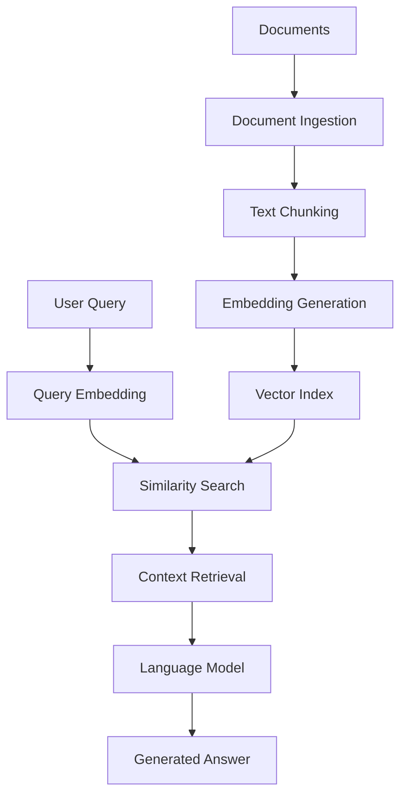

# Architecture Guide - Vector Bot

## Table of Contents

1. [Overview](#overview)
2. [System Components](#system-components)
3. [Data Flow](#data-flow)
4. [Storage Architecture](#storage-architecture)
5. [Configuration System](#configuration-system)
6. [CLI Architecture](#cli-architecture)
7. [Multi-Environment Support](#multi-environment-support)
8. [Executable Distribution](#executable-distribution)
9. [Performance Considerations](#performance-considerations)
10. [Security Model](#security-model)

## Overview

Vector Bot is a **Retrieval-Augmented Generation** system that combines:

- **Document Processing**: Converting files into searchable chunks
- **Vector Embeddings**: Semantic representation of text
- **Similarity Search**: Finding relevant content
- **Language Generation**: Answering questions using retrieved context



## System Components

### **1. Core Technologies**

| Component | Technology | Role |
|-----------|------------|------|
| **LLM Runtime** | Ollama | Hosts and runs language models locally |
| **RAG Framework** | LlamaIndex | Orchestrates indexing, retrieval, and generation |
| **Embeddings** | nomic-embed-text | Converts text to semantic vectors |
| **Chat Model** | llama3.1/llama3.2/etc | Generates answers from context |
| **CLI Interface** | Rich + argparse | User interaction and commands |
| **Configuration** | python-dotenv | Environment-based settings |

### **2. Application Layers**

```
┌─────────────────────────────────────────┐
│               CLI Layer                 │  ← User Interface
├─────────────────────────────────────────┤
│          Configuration Layer            │  ← Environment Management
├─────────────────────────────────────────┤
│             RAG Core Layer              │  ← Business Logic
├─────────────────────────────────────────┤
│         LlamaIndex Framework            │  ← RAG Orchestration
├─────────────────────────────────────────┤
│            Ollama Client                │  ← Model Communication
├─────────────────────────────────────────┤
│         Local File System              │  ← Document & Index Storage
└─────────────────────────────────────────┘
```

## Data Flow

### **Ingestion Pipeline**

```
1. Document Discovery
   ├── Scan DOCS_DIR for supported files
   ├── Filter by extension (.pdf, .txt, .md, .json, .csv)
   └── Skip files > 20MB

2. Document Processing
   ├── Load document content
   ├── Extract text (PDF parsing, etc.)
   └── Split into chunks (typically 512-1024 chars)

3. Embedding Generation
   ├── Send chunks to nomic-embed-text model
   ├── Generate 768-dimensional vectors
   └── Store embeddings with metadata

4. Index Construction
   ├── Build searchable vector index
   ├── Create document store mapping
   └── Persist to index_storage/
```

### **Query Pipeline**

```
1. Query Processing
   ├── Receive user question
   ├── Apply preprocessing/normalization
   └── Generate query embedding vector

2. Similarity Search
   ├── Compare query vector to document vectors
   ├── Calculate cosine similarity scores
   └── Retrieve top-k most similar chunks

3. Context Assembly
   ├── Collect retrieved document chunks
   ├── Add metadata (source files, scores)
   └── Format for language model input

4. Answer Generation
   ├── Send context + query to chat model
   ├── Generate response using retrieved information
   └── Return answer to user
```

## Storage Architecture

### **File System Layout**

```
project/
├── vector-bot.exe                    # Standalone executable
├── configs/                   # Environment configurations
│   ├── development.env        # Dev settings
│   ├── production.env         # Prod settings
│   └── docker.env             # Container settings
├── docs/                      # User documents (input)
│   ├── project-spec.pdf
│   ├── user-manual.md
│   └── api-docs.json
├── index_storage/             # Generated index (output)
│   ├── docstore.json          # Document chunks & metadata
│   ├── index_store.json       # Index structure
│   ├── vector_store.json      # Embedding vectors
│   └── graph_store.json       # Relationships
└── .env                       # Local configuration override
```

### **Index Storage Details**

#### **docstore.json**
```json
{
  "docstore": {
    "docs": {
      "doc_1": {
        "text": "The project requirements include...",
        "metadata": {
          "file_name": "requirements.pdf",
          "file_path": "/docs/requirements.pdf",
          "creation_date": "2024-01-15"
        }
      }
    }
  }
}
```

#### **vector_store.json**
```json
{
  "embedding_dict": {
    "doc_1": [0.123, -0.456, 0.789, ...],  // 768 dimensions
    "doc_2": [-0.234, 0.567, -0.891, ...]
  },
  "metadata_dict": {
    "doc_1": {"similarity_score": 0.95}
  }
}
```

## Configuration System

### **Configuration Hierarchy**

```
1. Command Line Arguments     (highest priority)
   ├── --env production
   └── --config-info

2. Environment Variables
   ├── OLLAMA_CHAT_MODEL=llama3.1
   └── SIMILARITY_TOP_K=6

3. Environment Config Files
   ├── configs/production.env
   └── configs/development.env

4. Local .env File
   └── .env

5. Built-in Defaults          (lowest priority)
   └── hardcoded in config.py
```

### **Configuration Loading Process**

```python
def load_config(env_name=None):
    # 1. Determine executable location
    executable_dir = get_executable_dir()
    
    # 2. Build search paths for config files
    config_paths = [
        executable_dir / f"configs/{env_name}.env",
        Path(f"configs/{env_name}.env"),
        executable_dir / ".env",
        Path(".env")
    ]
    
    # 3. Load first found config (don't override existing env vars)
    load_dotenv(config_file, override=False)
    
    # 4. Build final configuration with validation
    return validate_and_build_config()
```

## CLI Architecture

### **Command Structure**

```
vector-bot [global_options] <command> [command_options]

Global Options:
├── --env ENV          # Environment selection
├── --config-info      # Show configuration
└── --version          # Show version

Commands:
├── doctor             # Health check
├── ingest             # Index documents  
└── query "question"   # Ask questions
```

### **CLI Flow**

```python
def main():
    # 1. Parse arguments
    args = parse_arguments()
    
    # 2. Handle global options
    if args.config_info:
        show_configuration()
        return
    
    # 3. Load environment-specific config
    config = load_config(args.env)
    
    # 4. Execute command
    if args.command == "doctor":
        doctor(config)
    elif args.command == "ingest":
        ingest(config)
    elif args.command == "query":
        query(args.question, config)
```

## Multi-Environment Support

### **Environment Profiles**

| Environment | Use Case | Characteristics |
|-------------|----------|-----------------|
| **Development** | Local dev work | Verbose logging, local paths, debug mode |
| **Production** | Server deployment | Optimized settings, absolute paths, minimal logs |
| **Docker** | Containerized | Container networking, mounted volumes |

### **Environment-Specific Settings**

```bash
# Development
DOCS_DIR=./docs                    # Relative paths
LOG_LEVEL=DEBUG                    # Verbose logging
ENABLE_VERBOSE_OUTPUT=true         # Debug info
REQUEST_TIMEOUT=60                 # Standard timeout

# Production  
DOCS_DIR=/data/documents           # Absolute paths
LOG_LEVEL=INFO                     # Minimal logging
ENABLE_VERBOSE_OUTPUT=false        # No debug
REQUEST_TIMEOUT=120                # Longer timeout
EMBED_BATCH_SIZE=5                 # Smaller batches
```

## Executable Distribution

### **PyInstaller Bundle Structure**

```
vector-bot.exe
├── Python Runtime               # Embedded Python 3.10+
├── Dependencies                 # All pip packages
│   ├── llama-index-core
│   ├── llama-index-llms-ollama
│   ├── llama-index-embeddings-ollama
│   ├── requests
│   ├── rich
│   └── python-dotenv
├── Application Code             # Our Python modules
│   └── rag/
│       ├── cli.py
│       ├── config.py
│       ├── ingest.py
│       ├── query.py
│       └── ollama_check.py
├── Configuration Files          # Environment configs
│   └── configs/
│       ├── development.env
│       ├── production.env
│       └── docker.env
└── Entry Point                  # Bootstrap script
    └── rag_main.py
```

### **Runtime Path Resolution**

```python
def get_executable_dir():
    if getattr(sys, 'frozen', False):
        # Running as PyInstaller executable
        return Path(sys.executable).parent
    else:
        # Running as Python script
        return Path(__file__).parent.parent.parent

# This allows configs to be found whether running as:
# 1. vector-bot.exe --config-info
# 2. python -m rag.cli --config-info
```

## Performance Considerations

### **Indexing Performance**

| Factor | Impact | Optimization |
|--------|--------|-------------|
| **Document Size** | Linear with content | Chunk large files |
| **Embedding Model** | Batch processing | Use `EMBED_BATCH_SIZE=10` |
| **File Format** | PDF parsing overhead | Prefer text/markdown |
| **Storage Type** | I/O bottleneck | Use SSD for `index_storage/` |

### **Query Performance**

| Factor | Impact | Optimization |
|--------|--------|-------------|
| **Index Size** | Search complexity | Consider index pruning |
| **Similarity K** | Linear with K | Use minimal `--k` needed |
| **Chat Model** | Generation time | Balance model size vs speed |
| **Context Length** | Token processing | Limit chunk sizes |

### **Memory Usage**

```
Component Memory Usage:
├── Ollama Models
│   ├── llama3.1 (7B): ~4-8 GB RAM
│   └── nomic-embed: ~500 MB RAM
├── Vector Index
│   ├── ~768 bytes per chunk
│   └── Scales with document count
└── Application
    └── ~50-100 MB Python runtime
```

## Security Model

### **Threat Model**

The system is designed for **local-only operation** with these assumptions:

**Protected:**
- ✅ Documents never leave the machine
- ✅ No network calls except to localhost:11434
- ✅ All processing happens offline
- ✅ User controls all data and models

**Attack Vectors:**
- ⚠️ Malicious documents (PDF exploits, etc.)
- ⚠️ Model tampering (if Ollama compromised)
- ⚠️ File system permissions
- ⚠️ Input injection in queries

### **Security Measures**

```python
# Input validation
def validate_config(config):
    # Validate paths can be created
    # Check URL formats
    # Sanitize user inputs
    pass

# File handling
def load_documents(docs_dir):
    # Skip files > 20MB (DoS protection)
    # Validate file extensions
    # Handle parsing errors gracefully
    pass

# Network isolation
OLLAMA_BASE_URL = "http://localhost:11434"  # Only localhost
# No external API calls
# No telemetry or analytics
```

### **Privacy Model**

| Data Type | Storage Location | Network Access |
|-----------|------------------|----------------|
| **User Documents** | Local `docs/` folder | Never transmitted |
| **Generated Embeddings** | Local `index_storage/` | Never transmitted |
| **Chat History** | Not stored | Never transmitted |
| **Configuration** | Local env files | Never transmitted |
| **Model Weights** | Ollama local cache | Downloaded once |

## Integration Points

### **External Dependencies**

```
Vector Bot
├── Ollama Server (required)
│   ├── HTTP API on localhost:11434
│   ├── Model management
│   └── Inference execution
├── File System (required)
│   ├── Document storage
│   ├── Index persistence
│   └── Configuration files
└── Operating System (required)
    ├── Process management
    ├── Network stack (localhost only)
    └── File permissions
```

### **API Boundaries**

```
User Input → CLI → Config → RAG Core → LlamaIndex → Ollama API
                                   ↓
                              File System ← Index Storage
```

### **Error Handling Flow**

```python
try:
    # 1. Validate configuration
    config = load_config()
    
    # 2. Check Ollama connectivity  
    if not check_server():
        raise ConnectionError("Ollama not running")
    
    # 3. Validate models
    ensure_models_available()
    
    # 4. Execute command
    result = execute_command()
    
except ConfigurationError as e:
    console.print(f"Config error: {e}")
    return 1
except ConnectionError as e:
    console.print(f"Ollama error: {e}")
    return 1
except Exception as e:
    console.print(f"Unexpected error: {e}")
    return 1
```

## Testing Architecture

### **Test Structure**

```
tests/
├── unit/                  # Isolated unit tests
│   ├── test_cli.py       # CLI interface tests
│   ├── test_config.py    # Configuration tests
│   ├── test_ingest.py    # Ingestion logic tests
│   ├── test_query.py     # Query processing tests
│   └── test_ollama_check.py  # Health check tests
├── integration/          # End-to-end tests
│   └── test_integration.py
├── conftest.py          # Shared fixtures
└── README.md            # Testing documentation
```

### **Testing Strategy**

| Test Type | Purpose | Characteristics |
|-----------|---------|-----------------|
| **Unit Tests** | Test individual functions | Fully mocked, < 1s execution |
| **Integration Tests** | Test component interaction | Partial mocking, < 5s execution |
| **Smoke Tests** | Validate basic functionality | Real execution, requires Ollama |

### **Mocking Strategy**

```python
# External dependencies are fully mocked
@patch("requests.get")
@patch("llama_index.llms.ollama.Ollama")
@patch.object(Path, "exists")
def test_function(mock_path, mock_ollama, mock_requests):
    # Test runs completely offline
    # No network calls or file system access
    pass
```

### **Test Coverage Goals**

- **Core Logic**: 90%+ coverage
- **Error Paths**: All exceptions tested
- **Edge Cases**: Empty inputs, large files, timeouts
- **Platform Independence**: Tests pass on all OS

## Extensibility Points

### **Adding New Document Types**

```python
# In ingest.py, extend supported extensions:
extensions = [".txt", ".md", ".pdf", ".json", ".csv", ".docx"]  # Add .docx

# Add custom parser:
def load_docx(file_path):
    # Custom document loading logic
    pass
```

### **Custom Embedding Models**

```python
# In config.py, support new embedding models:
SUPPORTED_EMBED_MODELS = [
    "nomic-embed-text",
    "mxbai-embed-large", 
    "your-custom-model"   # Add new model
]
```

### **Alternative LLM Backends**

```python
# Current: Ollama only
# Future: Could extend to support OpenAI API, local transformers, etc.
def get_llm(config):
    if config["LLM_BACKEND"] == "ollama":
        return Ollama(...)
    elif config["LLM_BACKEND"] == "openai":
        return OpenAI(...)
```

---

This architecture provides a **secure, offline, and extensible** RAG system that can scale from personal use to enterprise deployment while maintaining complete data privacy and control.