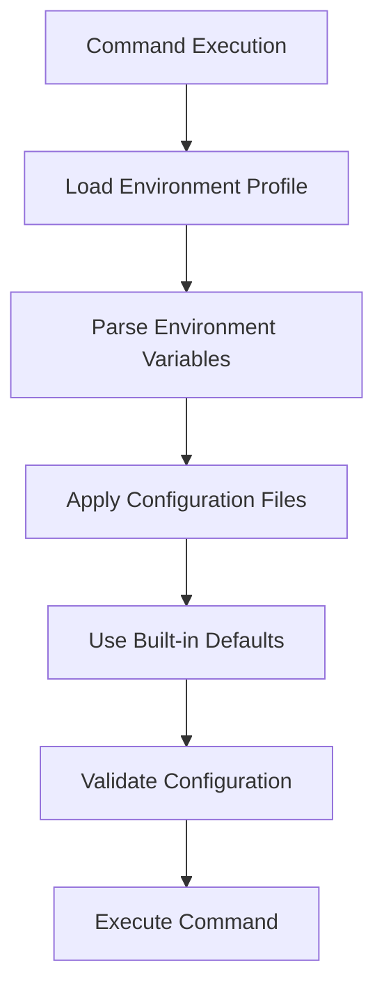

# Configuration Guide - Vector Bot

## Table of Contents

1. [Configuration Overview](#configuration-overview)
2. [Environment Variables](#environment-variables)
3. [Configuration Files](#configuration-files)
4. [Priority System](#priority-system)
5. [Environment Profiles](#environment-profiles)
6. [Path Resolution](#path-resolution)
7. [Configuration Commands](#configuration-commands)
8. [Examples](#examples)
9. [Troubleshooting](#troubleshooting)
10. [Advanced Configuration](#advanced-configuration)

## Configuration Overview

Vector Bot uses a **hierarchical configuration system** that allows flexible customization while providing sensible defaults. Configuration can be set through:

- **Environment variables** (highest priority)
- **Configuration files** (medium priority)
- **Built-in defaults** (lowest priority)

### Configuration Flow



## Environment Variables

### Core Configuration Variables

| Variable | Type | Default | Description |
|----------|------|---------|-------------|
| `DOCS_DIR` | Path | `./docs` | Directory containing your documents |
| `INDEX_DIR` | Path | `./index_storage` | Directory for storing vector index |
| `OLLAMA_BASE_URL` | URL | `http://localhost:11434` | Ollama server endpoint |
| `OLLAMA_CHAT_MODEL` | String | *auto-detect* | AI model for generating answers |
| `OLLAMA_EMBED_MODEL` | String | `nomic-embed-text` | Model for creating embeddings |
| `SIMILARITY_TOP_K` | Integer | `4` | Number of context chunks to retrieve |

### Performance Variables

| Variable | Type | Default | Description |
|----------|------|---------|-------------|
| `REQUEST_TIMEOUT` | Float | `60.0` | Timeout for Ollama requests (seconds) |
| `EMBED_BATCH_SIZE` | Integer | `10` | Number of chunks processed per batch |
| `LOG_LEVEL` | String | `INFO` | Logging verbosity (DEBUG, INFO, WARNING, ERROR) |
| `ENABLE_VERBOSE_OUTPUT` | Boolean | `false` | Show detailed processing information |

### System Variables

| Variable | Type | Default | Description |
|----------|------|---------|-------------|
| `RAG_ENV` | String | `development` | Environment profile to use |
| `RAG_VERBOSE` | Boolean | `false` | Show configuration loading details |

### Data Types and Formats

#### **Path Variables**
```bash
# Relative paths (resolved from executable location)
DOCS_DIR=./documents
INDEX_DIR=./my-index

# Absolute paths
DOCS_DIR=/data/documents
INDEX_DIR=/var/lib/rag/index

# Windows paths
DOCS_DIR=C:\Data\Documents
INDEX_DIR=D:\RAG\Index
```

#### **URL Variables**
```bash
# Local Ollama (default)
OLLAMA_BASE_URL=http://localhost:11434

# Remote Ollama server
OLLAMA_BASE_URL=http://192.168.1.100:11434

# Custom port
OLLAMA_BASE_URL=http://localhost:8080
```

#### **Boolean Variables**
```bash
# True values
ENABLE_VERBOSE_OUTPUT=true
ENABLE_VERBOSE_OUTPUT=True  
ENABLE_VERBOSE_OUTPUT=1

# False values (default)
ENABLE_VERBOSE_OUTPUT=false
ENABLE_VERBOSE_OUTPUT=False
ENABLE_VERBOSE_OUTPUT=0
```

#### **Model Variables**
```bash
# Specific model (must be installed in Ollama)
OLLAMA_CHAT_MODEL=llama3.1
OLLAMA_CHAT_MODEL=llama3.2
OLLAMA_CHAT_MODEL=mistral
OLLAMA_CHAT_MODEL=qwen2.5

# Auto-detection (default)
# OLLAMA_CHAT_MODEL=  # Leave empty or unset

# Embedding models
OLLAMA_EMBED_MODEL=nomic-embed-text     # Default
OLLAMA_EMBED_MODEL=mxbai-embed-large    # Alternative
```

## Configuration Files

### File Locations and Priority

1. **Environment-specific configs** (highest)
   - `configs/production.env`
   - `configs/development.env` 
   - `configs/docker.env`

2. **Local overrides** (medium)
   - `.env` (in current directory)
   - `.env.local`

3. **Built-in defaults** (lowest)
   - Hard-coded in `config.py`

### Environment Configuration Files

#### `configs/development.env`
```bash
# Development environment - verbose and local
DOCS_DIR=./docs
INDEX_DIR=./index_storage
OLLAMA_BASE_URL=http://localhost:11434
OLLAMA_EMBED_MODEL=nomic-embed-text
SIMILARITY_TOP_K=4

# Development-specific settings
LOG_LEVEL=DEBUG
ENABLE_VERBOSE_OUTPUT=true
REQUEST_TIMEOUT=60.0
EMBED_BATCH_SIZE=10
```

#### `configs/production.env`
```bash
# Production environment - optimized and absolute paths
DOCS_DIR=/data/documents
INDEX_DIR=/data/index_storage
OLLAMA_BASE_URL=http://localhost:11434
OLLAMA_EMBED_MODEL=nomic-embed-text
SIMILARITY_TOP_K=4

# Production-specific settings
LOG_LEVEL=INFO
ENABLE_VERBOSE_OUTPUT=false
REQUEST_TIMEOUT=120.0
EMBED_BATCH_SIZE=5
```

#### `configs/docker.env`
```bash
# Docker environment - container-specific networking
DOCS_DIR=/app/docs
INDEX_DIR=/app/index_storage
OLLAMA_BASE_URL=http://host.docker.internal:11434
OLLAMA_EMBED_MODEL=nomic-embed-text
SIMILARITY_TOP_K=4

# Docker-specific settings
LOG_LEVEL=INFO
ENABLE_VERBOSE_OUTPUT=false
REQUEST_TIMEOUT=90.0
EMBED_BATCH_SIZE=8
```

### Custom Configuration Files

#### Creating `.env` for Local Overrides
```bash
# Create local configuration file
cat > .env << EOF
# My custom settings
SIMILARITY_TOP_K=8
OLLAMA_CHAT_MODEL=llama3.3
LOG_LEVEL=DEBUG
DOCS_DIR=/home/user/my-documents
EOF
```

#### Project-Specific Configuration
```bash
# For different projects
mkdir project-a
cd project-a
echo "DOCS_DIR=./project-a-docs" > .env
echo "OLLAMA_CHAT_MODEL=llama3.1" >> .env

mkdir ../project-b  
cd ../project-b
echo "DOCS_DIR=./project-b-docs" > .env
echo "OLLAMA_CHAT_MODEL=mistral" >> .env
```

## Priority System

Configuration values are applied in this order (highest to lowest priority):

### 1. Command Line Arguments
```bash
# Override any setting via CLI
SIMILARITY_TOP_K=8 vector-bot query "test"
DOCS_DIR=/custom/path vector-bot ingest
```

### 2. Environment Variables
```bash
# Set in shell session
export SIMILARITY_TOP_K=6
export LOG_LEVEL=DEBUG
vector-bot query "test"
```

### 3. Local .env File
```bash
# In current directory
echo "SIMILARITY_TOP_K=5" > .env
vector-bot query "test"  # Uses 5
```

### 4. Environment Profile Files
```bash
# Via --env flag or RAG_ENV variable
vector-bot --env production query "test"    # Uses configs/production.env
RAG_ENV=docker vector-bot query "test"      # Uses configs/docker.env
```

### 5. Built-in Defaults
```bash
# When nothing else is specified
vector-bot query "test"  # Uses SIMILARITY_TOP_K=4
```

### Priority Example
```bash
# Given these configurations:
# configs/development.env: SIMILARITY_TOP_K=4
# .env: SIMILARITY_TOP_K=6
# Environment: SIMILARITY_TOP_K=8
# Command: SIMILARITY_TOP_K=10 vector-bot query "test"

# Result: Uses SIMILARITY_TOP_K=10 (command line wins)
```

## Environment Profiles

### Using Environment Profiles

#### Via Command Line Flag
```bash
# Specify environment explicitly
vector-bot --env development doctor
vector-bot --env production ingest  
vector-bot --env docker query "test"
```

#### Via Environment Variable
```bash
# Set environment for session
export RAG_ENV=production
vector-bot doctor    # Uses production settings
vector-bot ingest    # Uses production settings

# Override for single command
RAG_ENV=development vector-bot doctor
```

#### Via Configuration File Selection
```bash
# The system automatically loads in this order:
1. configs/${RAG_ENV}.env     # If RAG_ENV is set
2. configs/development.env    # Default fallback
3. Built-in defaults          # If no files found
```

### Profile Comparison

| Setting | Development | Production | Docker |
|---------|-------------|------------|--------|
| **Paths** | Relative (`./docs`) | Absolute (`/data/docs`) | Container (`/app/docs`) |
| **Logging** | `DEBUG` | `INFO` | `INFO` |
| **Verbose** | `true` | `false` | `false` |
| **Timeout** | `60s` | `120s` | `90s` |
| **Batch Size** | `10` | `5` | `8` |
| **Ollama URL** | `localhost:11434` | `localhost:11434` | `host.docker.internal:11434` |

## Path Resolution

### How Paths Are Resolved

```python
def resolve_path(path_str: str) -> Path:
    path = Path(path_str)
    
    # 1. Absolute paths used as-is
    if path.is_absolute():
        return path
    
    # 2. Relative paths resolved from executable location
    executable_dir = get_executable_dir()
    return (executable_dir / path).resolve()
```

### Executable vs. Script Mode

#### Executable Mode (vector-bot.exe)
```bash
# Executable location: C:\Tools\vector-bot.exe
DOCS_DIR=./docs        # Resolves to: C:\Tools\docs\
INDEX_DIR=./storage    # Resolves to: C:\Tools\storage\
```

#### Script Mode (python -m rag.cli)
```bash
# Project location: /home/user/rag-project/
DOCS_DIR=./docs        # Resolves to: /home/user/rag-project/docs/
INDEX_DIR=./storage    # Resolves to: /home/user/rag-project/storage/
```

### Path Examples

#### Windows Paths
```bash
# Relative
DOCS_DIR=.\documents
INDEX_DIR=.\my-index

# Absolute  
DOCS_DIR=C:\Data\Documents
DOCS_DIR=D:\Projects\RAG\Documents

# UNC paths
DOCS_DIR=\\server\share\documents
```

#### Unix/Linux Paths
```bash
# Relative
DOCS_DIR=./documents
INDEX_DIR=./my-index

# Absolute
DOCS_DIR=/home/user/documents
DOCS_DIR=/data/rag/documents

# With spaces (quoted)
DOCS_DIR="/home/user/My Documents"
```

## Configuration Commands

### Viewing Configuration

#### Show Current Configuration
```bash
# Show all settings with current values
vector-bot --config-info

# Output includes:
# - Executable directory
# - Environment being used  
# - All configuration values
# - Path existence status
```

#### Show Environment-Specific Configuration
```bash
# Check specific environment settings
vector-bot --config-info --env production
vector-bot --config-info --env development
vector-bot --config-info --env docker
```

#### Verbose Configuration Loading
```bash
# See which config files are being loaded
RAG_VERBOSE=true vector-bot --config-info

# Output shows:
# Loaded config from: /path/to/configs/development.env
```

### Validating Configuration

#### System Health Check
```bash
# Verify all components are configured correctly
vector-bot doctor

# Checks:
# - Ollama server connectivity
# - Model availability
# - Path permissions
# - Configuration validity
```

#### Environment-Specific Health Check
```bash
# Check production configuration
vector-bot --env production doctor

# Check development configuration  
vector-bot --env development doctor
```

## Examples

### Basic Configuration Examples

#### Simple Local Setup
```bash
# Use defaults for everything
mkdir docs
echo "My content" > docs/test.txt
vector-bot ingest
vector-bot query "What is the content?"
```

#### Custom Paths
```bash
# Use custom document location
export DOCS_DIR=/home/user/research-papers
export INDEX_DIR=/home/user/rag-index
vector-bot ingest
```

#### Remote Ollama Server
```bash
# Connect to Ollama on another machine
export OLLAMA_BASE_URL=http://192.168.1.100:11434
vector-bot doctor  # Test connection
```

#### Performance Tuning
```bash
# More context for complex questions
export SIMILARITY_TOP_K=8
vector-bot query "Explain the complex relationship between..."

# Faster processing with smaller batches
export EMBED_BATCH_SIZE=3
vector-bot ingest
```

### Advanced Configuration Examples

#### Multi-Project Setup
```bash
# Project A
mkdir project-a && cd project-a
cat > .env << EOF
DOCS_DIR=./project-a-docs
INDEX_DIR=./project-a-index
OLLAMA_CHAT_MODEL=llama3.1
EOF

# Project B  
mkdir ../project-b && cd ../project-b
cat > .env << EOF
DOCS_DIR=./project-b-docs
INDEX_DIR=./project-b-index
OLLAMA_CHAT_MODEL=mistral
EOF
```

#### Development vs. Production
```bash
# Development (verbose, local paths)
vector-bot --env development ingest
vector-bot --env development query "test" --verbose

# Production (quiet, absolute paths)  
vector-bot --env production ingest
vector-bot --env production query "test"
```

#### Docker Deployment
```dockerfile
# Dockerfile
FROM python:3.10
COPY vector-bot.exe /app/
WORKDIR /app
ENV RAG_ENV=docker
ENV DOCS_DIR=/data/docs
ENV INDEX_DIR=/data/index
VOLUME ["/data"]
ENTRYPOINT ["./vector-bot.exe"]
```

```bash
# Run container
docker run -v /host/docs:/data/docs \
           -v /host/index:/data/index \
           rag-image --env docker ingest
```

### Batch Processing Examples

#### Windows Batch Script
```batch
@echo off
set DOCS_DIR=C:\MyDocuments
set SIMILARITY_TOP_K=6
set LOG_LEVEL=INFO

echo Ingesting documents...
vector-bot.exe ingest

echo Asking questions...
vector-bot.exe query "What are the main topics?"
vector-bot.exe query "Summarize key findings"
```

#### Unix Shell Script
```bash
#!/bin/bash

# Configuration
export DOCS_DIR="/home/user/papers"
export SIMILARITY_TOP_K=8
export OLLAMA_CHAT_MODEL="llama3.1"

# Questions file
QUESTIONS_FILE="questions.txt"

# Process each question
while IFS= read -r question; do
    echo "Q: $question"
    vector-bot query "$question" --show-sources
    echo "---"
done < "$QUESTIONS_FILE"
```

## Troubleshooting

### Common Configuration Issues

#### Issue: "Configuration validation failed"
```bash
# Check configuration validity
vector-bot --config-info

# Common causes:
# - Invalid URL format
# - Non-existent paths
# - Invalid numeric values
```

#### Issue: "Ollama server not running"
```bash
# Check Ollama configuration
echo $OLLAMA_BASE_URL
curl $OLLAMA_BASE_URL/api/tags

# Fix:
export OLLAMA_BASE_URL=http://localhost:11434
ollama serve
```

#### Issue: "No documents found"
```bash
# Check document path configuration
vector-bot --config-info | grep DOCS_DIR

# Verify documents exist
ls $DOCS_DIR

# Fix path:
export DOCS_DIR=/correct/path/to/docs
```

#### Issue: "Model not found"
```bash
# Check available models
ollama list

# Set specific model
export OLLAMA_CHAT_MODEL=llama3.1

# Or install model
ollama pull llama3.1
```

### Configuration Debugging

#### Debug Configuration Loading
```bash
# See which files are loaded
RAG_VERBOSE=true vector-bot --config-info

# Check environment variables
env | grep -E "(DOCS_DIR|OLLAMA|SIMILARITY|RAG_)"

# Check file contents
cat .env
cat configs/development.env
```

#### Verify Path Resolution
```bash
# Check where paths are resolved
vector-bot --config-info

# Test absolute vs relative paths
DOCS_DIR=./test-docs vector-bot --config-info
DOCS_DIR=/tmp/test-docs vector-bot --config-info
```

#### Test Configuration Override
```bash
# Test priority system
echo "SIMILARITY_TOP_K=5" > .env
SIMILARITY_TOP_K=8 vector-bot --config-info
# Should show SIMILARITY_TOP_K: 8
```

## Advanced Configuration

### Custom Environment Profiles

#### Creating Custom Profiles
```bash
# Create custom environment
cat > configs/staging.env << EOF
# Staging environment
DOCS_DIR=/staging/documents  
INDEX_DIR=/staging/index
OLLAMA_BASE_URL=http://staging-ollama:11434
LOG_LEVEL=INFO
SIMILARITY_TOP_K=6
REQUEST_TIMEOUT=90.0
EOF

# Use custom environment
vector-bot --env staging doctor
```

#### Programmatic Configuration
```python
# Python script with custom config
import os
import subprocess

# Set configuration
os.environ.update({
    'DOCS_DIR': '/custom/documents',
    'SIMILARITY_TOP_K': '10',
    'LOG_LEVEL': 'DEBUG'
})

# Run RAG command
result = subprocess.run(['rag', 'query', 'test'], 
                       capture_output=True, text=True)
print(result.stdout)
```

### Integration with External Systems

#### Environment from External Source
```bash
# Load from remote config
curl -s http://config-server/rag-config > .env
vector-bot --config-info
```

#### Dynamic Configuration
```bash
# Generate config based on system
if [ $(hostname) == "production-server" ]; then
    export RAG_ENV=production
    export DOCS_DIR=/data/documents
else  
    export RAG_ENV=development
    export DOCS_DIR=./docs
fi

vector-bot ingest
```

#### Configuration Validation Script
```bash
#!/bin/bash
# validate-config.sh

echo "Validating RAG configuration..."

# Check Ollama
if ! curl -s $OLLAMA_BASE_URL/api/tags > /dev/null; then
    echo "ERROR: Cannot connect to Ollama at $OLLAMA_BASE_URL"
    exit 1
fi

# Check paths
if [ ! -d "$DOCS_DIR" ]; then
    echo "ERROR: DOCS_DIR does not exist: $DOCS_DIR"
    exit 1
fi

# Check models
if ! ollama list | grep -q "$OLLAMA_EMBED_MODEL"; then
    echo "WARNING: Embedding model not found: $OLLAMA_EMBED_MODEL"
fi

echo "Configuration is valid!"
```

### Performance Configuration Guidelines

#### Memory-Optimized Settings
```bash
# For systems with limited RAM
export EMBED_BATCH_SIZE=3          # Smaller batches
export SIMILARITY_TOP_K=3          # Fewer context chunks  
export REQUEST_TIMEOUT=300         # Longer timeout for slower processing
```

#### Speed-Optimized Settings
```bash
# For faster processing
export EMBED_BATCH_SIZE=20         # Larger batches
export SIMILARITY_TOP_K=2          # Minimal context
export REQUEST_TIMEOUT=30          # Shorter timeout
```

#### Network-Optimized Settings
```bash
# For remote Ollama servers
export REQUEST_TIMEOUT=180         # Longer timeout for network latency
export EMBED_BATCH_SIZE=5          # Smaller batches to reduce request size
```

---

This comprehensive configuration guide covers all aspects of configuring Vector Bot for any deployment scenario, from simple local use to complex multi-environment production deployments.