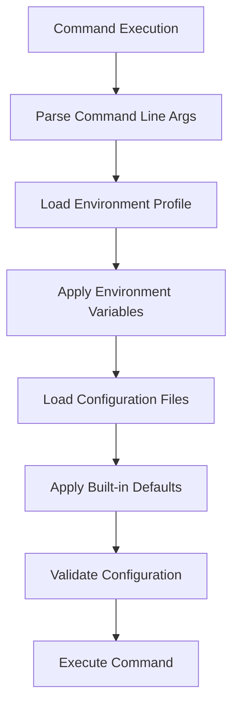

# Advanced Configuration Management

This guide covers comprehensive configuration management for Vector Bot, including multi-environment deployments, performance tuning, and enterprise-grade setups.

## Configuration Architecture

Vector Bot uses a hierarchical configuration system with multiple layers and precedence rules:



### Configuration Precedence (Highest to Lowest)

1. **Command-line environment variables**
2. **Shell environment variables**
3. **Local `.env` file**
4. **Environment profile files** (`configs/{env}.env`)
5. **Built-in defaults**

## Environment Profile Management

### Built-in Environment Profiles

Vector Bot includes three pre-configured environments:

#### Development Environment
```bash
# configs/development.env
DOCS_DIR=./docs
INDEX_DIR=./index_storage
OLLAMA_BASE_URL=http://localhost:11434
OLLAMA_EMBED_MODEL=nomic-embed-text
SIMILARITY_TOP_K=4

# Development-specific settings
LOG_LEVEL=DEBUG
ENABLE_VERBOSE_OUTPUT=true
REQUEST_TIMEOUT=60.0
EMBED_BATCH_SIZE=10
```

#### Production Environment
```bash
# configs/production.env
DOCS_DIR=/data/documents
INDEX_DIR=/data/index_storage
OLLAMA_BASE_URL=http://localhost:11434
OLLAMA_EMBED_MODEL=nomic-embed-text
SIMILARITY_TOP_K=4

# Production-specific settings
LOG_LEVEL=INFO
ENABLE_VERBOSE_OUTPUT=false
REQUEST_TIMEOUT=120.0
EMBED_BATCH_SIZE=5
```

#### Docker Environment
```bash
# configs/docker.env
DOCS_DIR=/app/docs
INDEX_DIR=/app/index_storage
OLLAMA_BASE_URL=http://host.docker.internal:11434
OLLAMA_EMBED_MODEL=nomic-embed-text
SIMILARITY_TOP_K=4

# Docker-specific settings
LOG_LEVEL=INFO
ENABLE_VERBOSE_OUTPUT=false
REQUEST_TIMEOUT=90.0
EMBED_BATCH_SIZE=8
```

### Custom Environment Profiles

Create custom profiles for specific deployment scenarios:

#### Staging Environment
```bash
# configs/staging.env
DOCS_DIR=/staging/documents
INDEX_DIR=/staging/index_storage
OLLAMA_BASE_URL=http://staging-ollama.company.com:11434
OLLAMA_CHAT_MODEL=llama3.1
OLLAMA_EMBED_MODEL=nomic-embed-text
SIMILARITY_TOP_K=6

# Staging-specific settings
LOG_LEVEL=INFO
ENABLE_VERBOSE_OUTPUT=false
REQUEST_TIMEOUT=90.0
EMBED_BATCH_SIZE=6

# Custom staging settings
ENABLE_METRICS=true
METRICS_ENDPOINT=http://staging-metrics.company.com:9090
```

#### High-Performance Environment
```bash
# configs/high-performance.env
DOCS_DIR=/fast-storage/documents
INDEX_DIR=/fast-storage/index
OLLAMA_BASE_URL=http://gpu-server:11434
OLLAMA_CHAT_MODEL=llama3.3
OLLAMA_EMBED_MODEL=mxbai-embed-large
SIMILARITY_TOP_K=12

# Performance-optimized settings
LOG_LEVEL=WARNING
ENABLE_VERBOSE_OUTPUT=false
REQUEST_TIMEOUT=180.0
EMBED_BATCH_SIZE=20

# Custom performance settings
ENABLE_GPU=true
MAX_CONCURRENT_REQUESTS=10
```

#### Multi-Tenant Environment
```bash
# configs/multi-tenant.env
DOCS_DIR=/tenants/{tenant_id}/documents
INDEX_DIR=/tenants/{tenant_id}/index
OLLAMA_BASE_URL=http://shared-ollama:11434
OLLAMA_EMBED_MODEL=nomic-embed-text
SIMILARITY_TOP_K=4

# Multi-tenant settings
LOG_LEVEL=INFO
ENABLE_VERBOSE_OUTPUT=false
REQUEST_TIMEOUT=120.0
EMBED_BATCH_SIZE=5

# Tenant isolation
ENABLE_TENANT_ISOLATION=true
TENANT_RATE_LIMIT=100
```

## Path Resolution and Management

### Path Resolution Strategy

```python
def resolve_path(path_str: str, base_dir: Optional[Path] = None) -> Path:
    """Vector Bot path resolution logic"""
    path = Path(path_str)
    
    # 1. Absolute paths used as-is
    if path.is_absolute():
        return path.resolve()
    
    # 2. Relative paths resolved from base directory
    if base_dir is None:
        base_dir = get_executable_directory()
    
    return (base_dir / path).resolve()
```

### Path Management Best Practices

#### Development vs Production Paths

```bash
# Development: Relative paths for portability
DOCS_DIR=./project-docs
INDEX_DIR=./project-index

# Production: Absolute paths for reliability
DOCS_DIR=/var/lib/vector-bot/documents
INDEX_DIR=/var/lib/vector-bot/index
```

#### Path Security Considerations

```bash
# Secure production paths with proper permissions
sudo mkdir -p /var/lib/vector-bot/{documents,index}
sudo chown vector-bot:vector-bot /var/lib/vector-bot/{documents,index}
sudo chmod 750 /var/lib/vector-bot/{documents,index}

# Separate user and service paths
DOCS_DIR=/var/lib/vector-bot/documents        # Service-owned
USER_UPLOAD_DIR=/var/spool/vector-bot/uploads  # User-writable staging
```

#### Network Storage Integration

```bash
# NFS mount configuration
DOCS_DIR=/mnt/shared-docs/vector-bot
INDEX_DIR=/mnt/shared-index/vector-bot

# S3-compatible storage (with local cache)
DOCS_DIR=/opt/vector-bot/cache/documents
INDEX_DIR=/opt/vector-bot/cache/index
REMOTE_DOCS_URL=s3://company-docs/vector-bot/
REMOTE_INDEX_URL=s3://company-index/vector-bot/
```

## Performance Configuration

### Memory Optimization

#### Low-Memory Systems (< 8GB RAM)
```bash
# configs/low-memory.env
EMBED_BATCH_SIZE=2
SIMILARITY_TOP_K=3
REQUEST_TIMEOUT=300
OLLAMA_CHAT_MODEL=llama3.1        # Smaller model
ENABLE_MEMORY_MAPPING=true
MAX_DOCUMENT_SIZE=10485760        # 10MB limit
```

#### Standard Systems (8-16GB RAM)
```bash
# configs/standard.env  
EMBED_BATCH_SIZE=5
SIMILARITY_TOP_K=4
REQUEST_TIMEOUT=120
OLLAMA_CHAT_MODEL=llama3.1
MAX_DOCUMENT_SIZE=20971520        # 20MB limit
```

#### High-Memory Systems (> 16GB RAM)
```bash
# configs/high-memory.env
EMBED_BATCH_SIZE=20
SIMILARITY_TOP_K=12
REQUEST_TIMEOUT=60
OLLAMA_CHAT_MODEL=llama3.3        # Larger model
MAX_DOCUMENT_SIZE=104857600       # 100MB limit
ENABLE_PARALLEL_PROCESSING=true
```

### CPU and I/O Optimization

```bash
# configs/performance-tuned.env

# CPU optimization
EMBED_BATCH_SIZE=10
PARALLEL_WORKERS=4
ENABLE_MULTITHREADING=true

# I/O optimization  
INDEX_WRITE_BUFFER_SIZE=1048576   # 1MB buffer
DOCUMENT_READ_BUFFER_SIZE=65536   # 64KB buffer
ENABLE_INDEX_COMPRESSION=true

# Network optimization
CONNECTION_POOL_SIZE=10
KEEP_ALIVE_TIMEOUT=30
REQUEST_RETRY_COUNT=3
```

### GPU Acceleration Configuration

```bash
# configs/gpu-accelerated.env
OLLAMA_BASE_URL=http://gpu-server:11434
OLLAMA_CHAT_MODEL=llama3.3
OLLAMA_EMBED_MODEL=mxbai-embed-large

# GPU-specific settings
ENABLE_GPU=true
GPU_MEMORY_FRACTION=0.8
GPU_BATCH_SIZE=32
CUDA_VISIBLE_DEVICES=0,1
```

## Security Configuration

### Authentication and Authorization

```bash
# configs/secure.env

# Authentication
ENABLE_AUTHENTICATION=true
AUTH_METHOD=jwt
JWT_SECRET_KEY_FILE=/etc/vector-bot/jwt-secret
SESSION_TIMEOUT=3600

# Authorization
ENABLE_RBAC=true
USER_ROLES_FILE=/etc/vector-bot/user-roles.json
DEFAULT_ROLE=readonly

# Document access control
ENABLE_DOCUMENT_ACL=true
ACL_CONFIG_FILE=/etc/vector-bot/document-acl.json
```

### Network Security

```bash
# configs/network-secure.env

# TLS configuration
OLLAMA_BASE_URL=https://ollama.company.com:11434
TLS_CERT_FILE=/etc/vector-bot/tls/cert.pem
TLS_KEY_FILE=/etc/vector-bot/tls/key.pem
TLS_CA_FILE=/etc/vector-bot/tls/ca.pem

# Network restrictions
ALLOWED_IP_RANGES=10.0.0.0/8,192.168.0.0/16
BLOCKED_IP_RANGES=0.0.0.0/0
ENABLE_RATE_LIMITING=true
RATE_LIMIT_REQUESTS_PER_MINUTE=100
```

### Data Protection

```bash
# configs/data-protection.env

# Encryption at rest
ENABLE_ENCRYPTION=true
ENCRYPTION_KEY_FILE=/etc/vector-bot/encryption.key
ENCRYPTION_ALGORITHM=AES-256-GCM

# Data sanitization
ENABLE_PII_DETECTION=true
PII_SCRUBBING_LEVEL=aggressive
DATA_RETENTION_DAYS=90

# Audit logging
ENABLE_AUDIT_LOGGING=true
AUDIT_LOG_FILE=/var/log/vector-bot/audit.log
AUDIT_LOG_LEVEL=INFO
```

## Monitoring and Observability

### Logging Configuration

```bash
# configs/logging.env

# Log levels and output
LOG_LEVEL=INFO
LOG_FORMAT=json
LOG_OUTPUT=file
LOG_FILE=/var/log/vector-bot/vector-bot.log

# Log rotation
ENABLE_LOG_ROTATION=true
MAX_LOG_SIZE=100MB
MAX_LOG_FILES=10

# Structured logging
ENABLE_STRUCTURED_LOGGING=true
LOG_CORRELATION_ID=true
LOG_USER_CONTEXT=true
```

### Metrics and Monitoring

```bash
# configs/monitoring.env

# Prometheus metrics
ENABLE_METRICS=true
METRICS_PORT=9090
METRICS_PATH=/metrics

# Health checks
ENABLE_HEALTH_CHECKS=true
HEALTH_CHECK_INTERVAL=30
HEALTH_CHECK_TIMEOUT=10

# Alerting
ENABLE_ALERTING=true
ALERT_WEBHOOK_URL=http://alertmanager:9093/api/v1/alerts
ALERT_THRESHOLDS_FILE=/etc/vector-bot/alert-thresholds.json
```

### Distributed Tracing

```bash
# configs/tracing.env

# OpenTelemetry configuration
ENABLE_TRACING=true
OTEL_EXPORTER_OTLP_ENDPOINT=http://jaeger:14268/api/traces
OTEL_SERVICE_NAME=vector-bot
OTEL_SERVICE_VERSION=1.0.0

# Trace sampling
TRACE_SAMPLE_RATE=0.1
ENABLE_TRACE_CORRELATION=true
```

## Multi-Environment Deployment

### Environment Inheritance

Create a hierarchy of configuration files:

```bash
# Base configuration (configs/base.env)
OLLAMA_EMBED_MODEL=nomic-embed-text
SIMILARITY_TOP_K=4
LOG_FORMAT=json
ENABLE_METRICS=true

# Development inherits from base (configs/development.env)
source configs/base.env
LOG_LEVEL=DEBUG
ENABLE_VERBOSE_OUTPUT=true
DOCS_DIR=./docs

# Production inherits from base (configs/production.env)  
source configs/base.env
LOG_LEVEL=INFO
ENABLE_VERBOSE_OUTPUT=false
DOCS_DIR=/var/lib/vector-bot/documents
```

### Configuration Templating

Use templates for dynamic configuration:

```bash
# configs/template.env
DOCS_DIR=${VECTOR_BOT_HOME}/documents
INDEX_DIR=${VECTOR_BOT_HOME}/index
OLLAMA_BASE_URL=http://${OLLAMA_HOST}:${OLLAMA_PORT}
LOG_FILE=/var/log/${SERVICE_NAME}/vector-bot.log

# Deployment script
export VECTOR_BOT_HOME=/opt/vector-bot
export OLLAMA_HOST=ollama.company.com
export OLLAMA_PORT=11434
export SERVICE_NAME=vector-bot-prod

envsubst < configs/template.env > /etc/vector-bot/config.env
```

### Environment Switching

```bash
#!/bin/bash
# switch-environment.sh

ENVIRONMENT=$1
if [ -z "$ENVIRONMENT" ]; then
    echo "Usage: switch-environment.sh <environment>"
    exit 1
fi

CONFIG_FILE="configs/${ENVIRONMENT}.env"
if [ ! -f "$CONFIG_FILE" ]; then
    echo "Configuration file not found: $CONFIG_FILE"
    exit 1
fi

# Validate configuration
if vector-bot --env "$ENVIRONMENT" doctor --quiet; then
    echo "Switched to environment: $ENVIRONMENT"
    export RAG_ENV="$ENVIRONMENT"
else
    echo "Configuration validation failed for environment: $ENVIRONMENT"
    exit 1
fi
```

## Configuration Validation

### Validation Scripts

```bash
#!/bin/bash
# validate-config.sh

ENVIRONMENT=${1:-development}

echo "Validating Vector Bot configuration for environment: $ENVIRONMENT"

# Check basic connectivity
if ! vector-bot --env "$ENVIRONMENT" doctor; then
    echo "ERROR: Basic health check failed"
    exit 1
fi

# Check document directory
DOCS_DIR=$(vector-bot --env "$ENVIRONMENT" --config-info | grep "Documents Directory" | awk '{print $3}')
if [ ! -d "$DOCS_DIR" ]; then
    echo "ERROR: Documents directory does not exist: $DOCS_DIR"
    exit 1
fi

# Check write permissions
INDEX_DIR=$(vector-bot --env "$ENVIRONMENT" --config-info | grep "Index Directory" | awk '{print $3}')
if [ ! -w "$(dirname "$INDEX_DIR")" ]; then
    echo "ERROR: No write permission for index directory parent: $(dirname "$INDEX_DIR")"
    exit 1
fi

# Check Ollama models
REQUIRED_MODELS=("nomic-embed-text")
for model in "${REQUIRED_MODELS[@]}"; do
    if ! ollama list | grep -q "$model"; then
        echo "WARNING: Required model not found: $model"
    fi
done

echo "Configuration validation completed successfully"
```

### Automated Testing

```python
# config-test.py
import subprocess
import json
import os

class ConfigurationTester:
    def __init__(self, environment):
        self.environment = environment
        self.errors = []
        self.warnings = []
    
    def test_basic_connectivity(self):
        """Test basic Vector Bot connectivity"""
        result = subprocess.run(
            ['vector-bot', '--env', self.environment, 'doctor'],
            capture_output=True, text=True
        )
        if result.returncode != 0:
            self.errors.append(f"Basic connectivity failed: {result.stderr}")
        return result.returncode == 0
    
    def test_paths(self):
        """Test path accessibility and permissions"""
        config_result = subprocess.run(
            ['vector-bot', '--env', self.environment, '--config-info'],
            capture_output=True, text=True
        )
        
        # Extract paths from configuration
        # ... parse config and test paths ...
    
    def test_models(self):
        """Test required model availability"""
        result = subprocess.run(['ollama', 'list'], capture_output=True, text=True)
        if 'nomic-embed-text' not in result.stdout:
            self.warnings.append("Default embedding model not found")
    
    def run_all_tests(self):
        """Run all configuration tests"""
        tests = [
            self.test_basic_connectivity,
            self.test_paths,
            self.test_models
        ]
        
        for test in tests:
            try:
                test()
            except Exception as e:
                self.errors.append(f"Test {test.__name__} failed: {str(e)}")
        
        return len(self.errors) == 0
```

## Configuration Management Tools

### Configuration Backup and Restore

```bash
#!/bin/bash
# backup-config.sh

BACKUP_DIR="/var/backups/vector-bot/$(date +%Y-%m-%d)"
mkdir -p "$BACKUP_DIR"

# Backup configuration files
cp -r configs/ "$BACKUP_DIR/"
cp .env "$BACKUP_DIR/" 2>/dev/null || true

# Backup current environment state
env | grep -E "(RAG_|DOCS_|OLLAMA_|SIMILARITY_)" > "$BACKUP_DIR/environment.txt"

# Create restoration script
cat > "$BACKUP_DIR/restore.sh" << 'EOF'
#!/bin/bash
CONFIG_DIR=$(dirname "$0")
cp -r "$CONFIG_DIR/configs/" ./
cp "$CONFIG_DIR/.env" ./ 2>/dev/null || true
echo "Configuration restored from backup"
EOF

chmod +x "$BACKUP_DIR/restore.sh"
echo "Configuration backed up to: $BACKUP_DIR"
```

### Configuration Synchronization

```bash
#!/bin/bash
# sync-config.sh

SOURCE_ENV=${1:-development}
TARGET_ENV=${2:-production}

echo "Synchronizing configuration from $SOURCE_ENV to $TARGET_ENV"

# Create backup of target
cp "configs/${TARGET_ENV}.env" "configs/${TARGET_ENV}.env.backup"

# Copy base configuration
grep -v -E "(LOG_LEVEL|DOCS_DIR|INDEX_DIR)" "configs/${SOURCE_ENV}.env" > temp_config

# Add environment-specific overrides
case "$TARGET_ENV" in
    "production")
        echo "LOG_LEVEL=INFO" >> temp_config
        echo "DOCS_DIR=/var/lib/vector-bot/documents" >> temp_config
        echo "INDEX_DIR=/var/lib/vector-bot/index" >> temp_config
        ;;
    "staging")
        echo "LOG_LEVEL=INFO" >> temp_config
        echo "DOCS_DIR=/staging/documents" >> temp_config
        echo "INDEX_DIR=/staging/index" >> temp_config
        ;;
esac

mv temp_config "configs/${TARGET_ENV}.env"
echo "Configuration synchronized"
```

## Troubleshooting Advanced Configurations

### Configuration Debug Mode

```bash
#!/bin/bash
# debug-config.sh

ENVIRONMENT=${1:-development}

echo "=== Vector Bot Configuration Debug Report ==="
echo "Environment: $ENVIRONMENT"
echo "Date: $(date)"
echo ""

echo "=== Environment Variables ==="
env | grep -E "(RAG_|DOCS_|OLLAMA_|SIMILARITY_)" | sort
echo ""

echo "=== Configuration Files ==="
echo "Environment profile: configs/${ENVIRONMENT}.env"
if [ -f "configs/${ENVIRONMENT}.env" ]; then
    echo "Profile exists: YES"
    echo "Profile contents:"
    cat "configs/${ENVIRONMENT}.env"
else
    echo "Profile exists: NO"
fi
echo ""

echo "Local .env file:"
if [ -f ".env" ]; then
    echo ".env exists: YES" 
    echo ".env contents:"
    cat ".env"
else
    echo ".env exists: NO"
fi
echo ""

echo "=== Computed Configuration ==="
vector-bot --env "$ENVIRONMENT" --config-info
echo ""

echo "=== Health Check ==="
vector-bot --env "$ENVIRONMENT" doctor --verbose
```

### Performance Profiling

```bash
#!/bin/bash
# profile-performance.sh

ENVIRONMENT=${1:-development}

echo "=== Performance Profile for Environment: $ENVIRONMENT ==="

# Profile ingestion
echo "Profiling document ingestion..."
time vector-bot --env "$ENVIRONMENT" ingest

# Profile different query complexities
for k in 2 4 8 12; do
    echo "Profiling query with k=$k..."
    time vector-bot --env "$ENVIRONMENT" query "What are the main topics?" --k $k >/dev/null
done

# System resources during operation
echo "System resource usage:"
top -n 1 | head -20
```

---

## Best Practices Summary

### Development Environment
- Use relative paths for portability
- Enable verbose logging and output
- Use smaller models for faster iteration
- Keep configurations in version control

### Production Environment  
- Use absolute paths for reliability
- Optimize for performance and stability
- Implement comprehensive monitoring
- Regular configuration backups

### Security
- Encrypt sensitive configuration data
- Implement proper access controls
- Use secure network protocols
- Regular security audits

### Maintenance
- Automated configuration validation
- Regular performance profiling
- Configuration change tracking
- Disaster recovery procedures

---

For detailed configuration variable reference, see [Configuration Variables](../reference/configuration-vars.md).